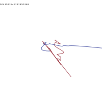
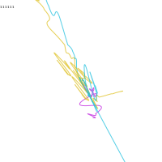

# dancepartners

Demo app for [dicey](https://github.com/line-o/dicey).
Needs version 2.0.0 or later.

Whenever you reload the [application](http://localhost:8080/exist/apps/dancepartners/) you will get a new random image from the dancepartners generator.

If you provide a (numeric) seed the (e.g. [?seed=111111](http://localhost:8080/exist/apps/dancepartners/?seed=111111)) the image will stay the same.

